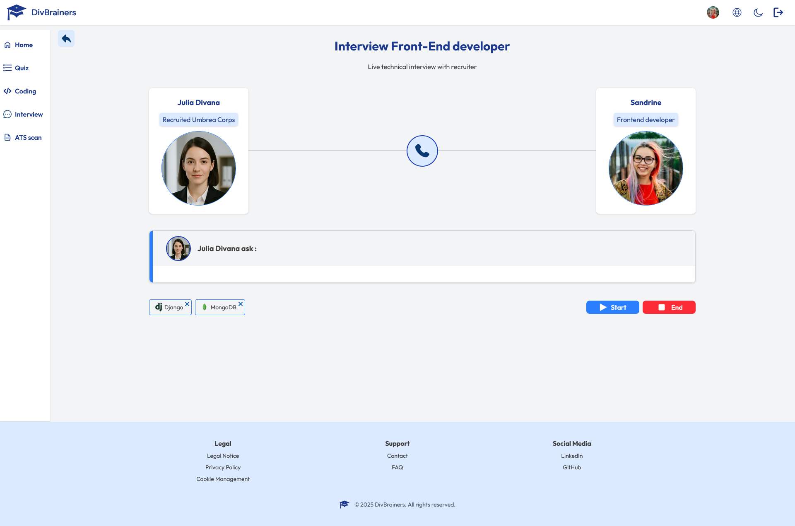
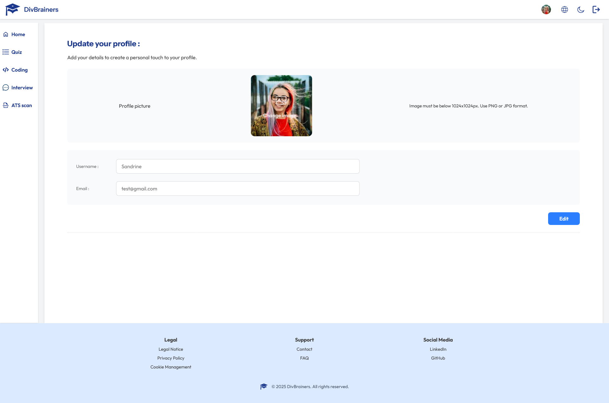
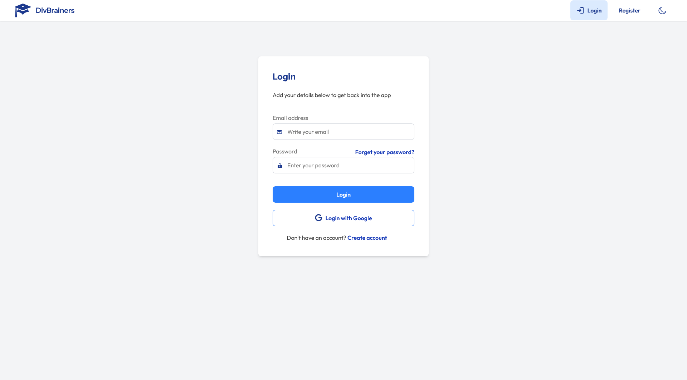
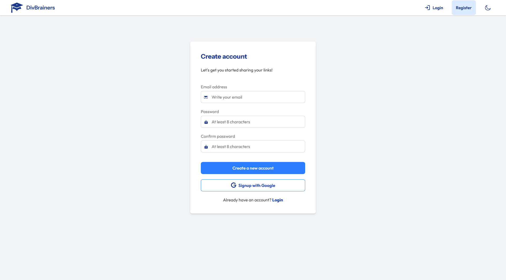
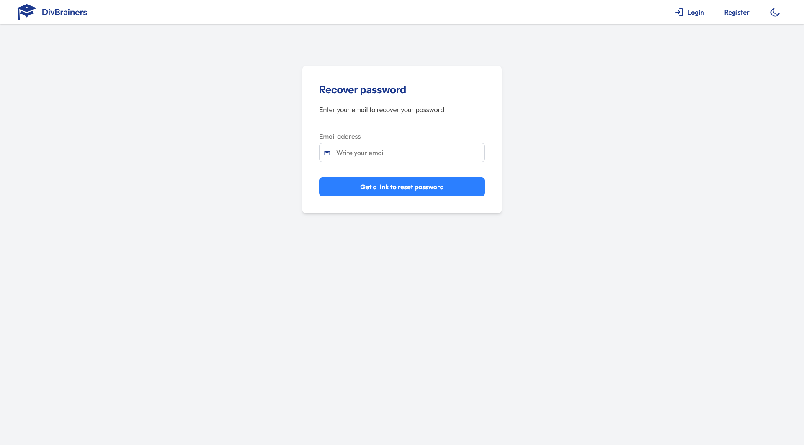

# DivBrainers – Developer Interview Prep Platform

**DivBrainers** is a full-stack an open-source application that helps developers to prepare for technical job interviews. It combines AI-driven interviews, a secure dashboard, and upcoming tools like coding challenges, quizzes, and ATS resume analysis to offer a complete preparation kit.

## Table of contents

- [Overview](#overview)
  - [Usage details](#usage-details)
  - [Screenshots](#screenshots)
  - [Links](#links)
- [My process](#my-process)
  - [Try](#try)
  - [Built with](#built-with)
  - [Key Features](#key-features)
  - [What I learned](#what-i-learned)
  - [Continued development](#continued-development)
- [Author](#author)

---

## Overview

### Usage details

DivBrainers allows users to:

- Access an AI-powered interview simulation
- Use a secure, personalized dashboard
- Edit their profile (name, avatar, email)
- Soon: practice coding challenges and quizzes
- Soon: scan resumes for ATS compatibility

### Screenshots

### Links

- Live Site: [https:divbrainers.com](https:divbrainers.com)

---

## My process

### Try

You can create an account or register with google.

### Built with

- **Next.js 15** – React framework for production
- **React 19** – JavaScript library for building user interfaces
- **TypeScript** – JavaScript with syntax for types
- **TailwindCSS v4** – Utility-first CSS framework
- **Zustand** – Simple state management
- **Prisma** – Modern database toolkit
- **PostgreSQL** – Open source relational database
- **Zod + React Hook Form** – Form validation tools
- **NextAuth.js** – Authentication for Next.js
- **Cloudinary** – Cloud-based image management
- **Jest + Testing Library + jest-axe** – Testing tools
- **Nodemailer** – Module for email sending

### Key Features

#### ✅ Already developed

- **Landing Page**  
  Highlights the value of the platform and encourages sign-ups.

- **Secure Dashboard**  
   Protected access to user data and progress.

- **Profile Management**  
  Users can update their name, email, and avatar image.

- **AI Interview Assistant**  
  Simulates real interview scenarios using Gemini + Vapi.

#### 🔜 Coming soon

- **Home Dashboard Overview**  
  Centralized view of recent activity, tips, and performance.

- **Quiz Module**  
  Multiple-choice questions covering CS fundamentals.

- **Coding Challenges**  
  Timed, browser-based programming exercises.

- **ATS Resume Scanner**  
  Analyze and optimize CVs for recruiter filtering systems.

- **Statistics Dashboard**  
  Visualize your progress, track performance metrics, and identify improvement areas.

### What I learned

- Structuring complex apps with Prisma + PostgreSQL
- Using advanced form validation with Zod
- Setting up secure authentication with NextAuth and Prisma Adapter
- Building accessible and tested UI with Testing Library + jest-axe
- Setting up automated queries with ts-node and Prisma
- Creating type-safe Server Actions for form submissions and data mutations

### Continued development

- **Social Community Features** – Enable users to interact, comment, follow each other, and share progress.
- **Gamification System** – Introduce points, badges, and progress tracking to increase user engagement and motivation.
- **Job Board Integration** – Display curated job offers relevant to each user's profile and interview performance.
- **Job Search Management** – Allow users to track applications, manage interview schedules, and organize their job search process efficiently.

## Author

- **GitHub** – [@Stv-devl](https://github.com/Stv-devl)
- **LinkedIn** – [Stevan L.](https://www.linkedin.com/in/stevan-l-793141128/)
- **Portfolio** – [www.stevandev.com](https://www.stevandev.com/)
